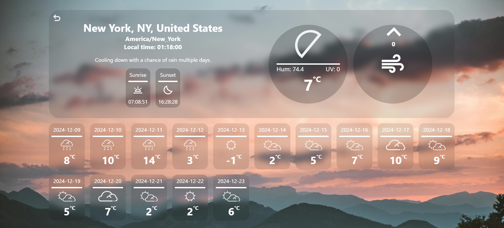

# Weather App

A basic weather application that provides weather updates for a given location. Built using modern web development tools for an optimized and maintainable experience.

## Features

- Search for current weather conditions in any city.
- Real-time weather updates powered by external APIs.

## Technologies Used

- **JavaScript**: Core functionality of the app.
- **Webpack**: Bundling and optimizing the code.
- **ESLint & Prettier**: Enforcing code quality and consistent formatting.
- **HTML & CSS**: Structure and styling.

## Live Demo

[Weather App Live Demo](https://elvborn.github.io/weather-app/)

## Screenshot

